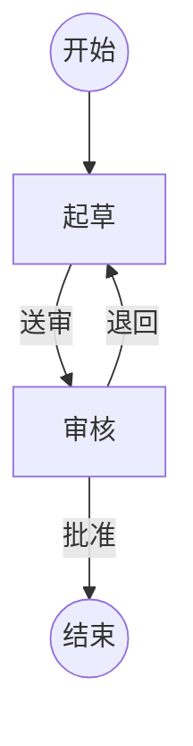

```mermaid
flowchart TD
  start((开始)) --> draft[起草]
  draft -->|送审| review[审核]
  review -->|退回| draft
  review -->|批准| finish((结束))
```

## 起草

```新建Agent
起草「{var.主题}」，当前版本 {var.版本}。
```

### 送审

| 变量 | 含义 |
| --- | --- |
| 摘要 | 送审草稿摘要 |

草稿已准备好。

## 审核

```confirm
请审核第 {var.版本} 版：{input.摘要}
```

### 退回

需要修改。

### 批准

审核通过。
