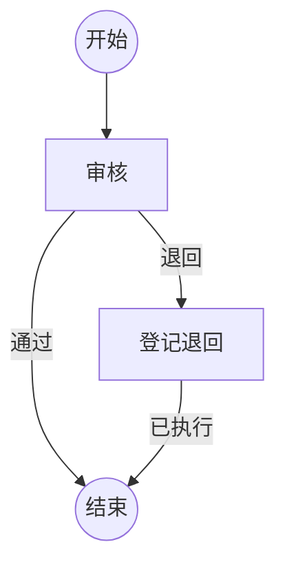

```mermaid
flowchart TD
  start((开始)) --> review[审核]
  review -->|通过| finish((结束))
  review -->|退回| rework[登记退回]
  rework -->|已执行| finish
```

## 审核

```新建Agent
审核 {var.材料}
```

### 通过

材料符合要求。

### 退回

| 变量 | 含义 |
| --- | --- |
| 回执 | 已审核的材料标记 |

材料需要补充。

## 登记退回

```执行自定义命令
{"command":"true"}
```

### 已执行

已登记退回。
