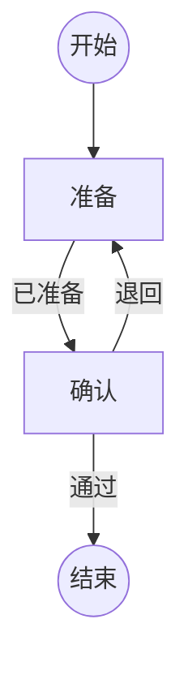

```mermaid
flowchart TD
  start((开始)) --> prepare[准备]
  prepare -->|已准备| gate[确认]
  gate -->|通过| finish((结束))
  gate -->|退回| prepare
```

## 准备
```新建Agent
准备 {var.任务}
```
### 已准备
准备完毕。

## 确认
```confirm
请确认 {var.任务} 的准备结果。
```
### 通过
准备通过。

### 退回
需要重新准备。
